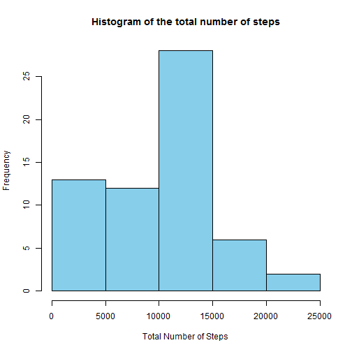
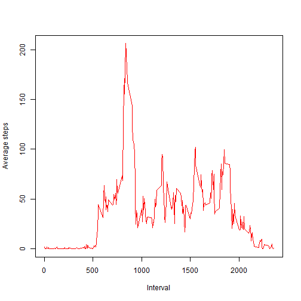
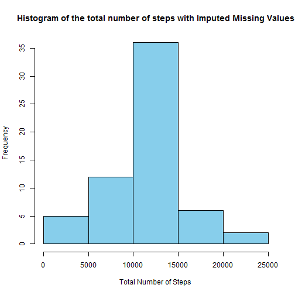

Loading the data required for the Assignment:
Note to the readers/peers: Set the working directory appropriately.


```r
#Read the input data for the assignment
setwd("D:/Personal/R/Coursera/Course5-W1");
activity <- read.csv("activity.csv",stringsAsFactors=FALSE);

activity$date <- as.POSIXct(activity$date, format="%Y-%m-%d");
```

******** What is the mean total number of steps taken per day *******

Loading the plyr package to easily manipulating the data in data frame. Also creating R code for finding out mean total number of steps taken per day. 


```r
library(plyr);
```

```
## Warning: package 'plyr' was built under R version 3.2.3
```

```r
TotalSteps <- aggregate(activity$steps, by=list(activity$date), FUN=sum, na.rm=TRUE)

head(TotalSteps)
```

```
##      Group.1     x
## 1 2012-10-01     0
## 2 2012-10-02   126
## 3 2012-10-03 11352
## 4 2012-10-04 12116
## 5 2012-10-05 13294
## 6 2012-10-06 15420
```

```r
 hist(TotalSteps$x,xlab = "Total Number of Steps",col = 'sky blue',main = 'Histogram of the total number of steps')
```



******** Calculate and report the mean and median of the total number of steps taken per day. ******** 

A summary of the data set will give us valuable information on the dataset including mean and median.

```r
summary(TotalSteps$x)
```

```
##    Min. 1st Qu.  Median    Mean 3rd Qu.    Max. 
##       0    6778   10400    9354   12810   21190
```

From the result we can see that the mean is 9354 and median is 10400.

******** What is the average daily activity pattern? ******** 
1. Make a time series plot (i.e. type = "l") of the 5-minute interval (x-axis) and the average number of steps taken, averaged across all days (y-axis)


```r
 #Calculate the average steps per interval
Average_Data <- aggregate(activity$steps,by=list(activity$interval), FUN=mean,na.rm=TRUE)
 
 head(Average_Data)
```

```
##   Group.1         x
## 1       0 1.7169811
## 2       5 0.3396226
## 3      10 0.1320755
## 4      15 0.1509434
## 5      20 0.0754717
## 6      25 2.0943396
```

```r
#Draw the time series plot.
 
plot(Average_Data$Group.1,Average_Data$x,type="l",col="red",xlab="Interval",ylab="Average steps" )
```


2. Which 5-minute interval, on average across all the days in the dataset, contains the maximum number of steps

From the pattern it seems the max steps lies halfway between 500 and 1000. Lets find out.


```r
max_step <- which(Average_Data$x == max(Average_Data$x))
max_interval <- Average_Data[max_step,1]
```
  The interval 835 contains max steps on an average.

********* Imputing missing values ************


1. Calculate and report the total number of missing values in the dataset (i.e. the total number of rows with NAs)


```r
sum(is.na(activity$steps))
```

```
## [1] 2304
```

The number of missing values are 2304.

2. Devise a strategy for filling in all of the missing values in the dataset. The strategy does not need to be sophisticated. For example, you could use the mean/median for that day, or the mean for that 5-minute interval, etc.


```r
# Find the rows with NA value in steps column
na_steps <- which(is.na(activity$steps))

# Create a vector of means which can be assigned to NA values.
mean_assign <- rep(mean(activity$steps, na.rm=TRUE), times=length(na_steps))
```

3.Create a new dataset that is equal to the original dataset but with the missing data filled in.


```r
# Replace the NAs by the means created in the previous step.
activity[na_steps, "steps"] <- mean_assign
```

4. Make a histogram of the total number of steps taken each day and calculate and report the mean and median total number of steps taken per day. Do these values differ from the estimates from the first part of the assignment? What is the impact of imputing missing data on the estimates of the total daily number of steps?


```r
TotalSteps <- aggregate(activity$steps, by=list(activity$date), FUN=sum)

hist(TotalSteps$x,xlab = "Total Number of Steps",col = 'sky blue',main = 'Histogram of the total number of steps with Imputed Missing Values')
```



Find out the mean and median of the data set with replaced missing values.


```r
summary(TotalSteps$x)
```

```
##    Min. 1st Qu.  Median    Mean 3rd Qu.    Max. 
##      41    9819   10770   10770   12810   21190
```

The mean and median seem to be 10770.

Imputing the missing value with the mean value does not seem to impact the outcome much.

********** Are there differences in activity patterns between weekdays and weekends? **********

1. Create a new factor variable in the dataset with two levels - "weekday" and "weekend" indicating whether a given date is a weekday or weekend day.


```r
# Find out the day if the week.
activity_withDay <- data.frame(date=activity$date,weekday=tolower(weekdays(activity$date)), steps=activity$steps,  interval=activity$interval)

head(activity_withDay)
```

```
##         date weekday   steps interval
## 1 2012-10-01  monday 37.3826        0
## 2 2012-10-01  monday 37.3826        5
## 3 2012-10-01  monday 37.3826       10
## 4 2012-10-01  monday 37.3826       15
## 5 2012-10-01  monday 37.3826       20
## 6 2012-10-01  monday 37.3826       25
```

```r
activity<- cbind(activity,dayFactor = ifelse(activity_withDay$weekday == "saturday" | activity_withDay$weekday == "sunday", "weekend", "weekday"))

head(activity)
```

```
##     steps       date interval dayFactor
## 1 37.3826 2012-10-01        0   weekday
## 2 37.3826 2012-10-01        5   weekday
## 3 37.3826 2012-10-01       10   weekday
## 4 37.3826 2012-10-01       15   weekday
## 5 37.3826 2012-10-01       20   weekday
## 6 37.3826 2012-10-01       25   weekday
```

2.Make a panel plot containing a time series plot (i.e. type = "l") of the 5-minute interval (x-axis) and the average number of steps taken, averaged across all weekday days or weekend days (y-axis). See the README file in the GitHub repository to see an example of what this plot should look like using simulated data.


```r
Avg_Data <- aggregate(activity$steps, 
                       by=list(activity$dayName, 
                               activity$dayFactor, activity$interval), mean)
```

```
## Error in aggregate.data.frame(as.data.frame(x), ...): arguments must have same length
```

```r
head(Avg_Data)
```

```
## Error in head(Avg_Data): object 'Avg_Data' not found
```

```r
# Rename the attributes for readability.
names(Avg_Data) <- c("daytype", "weekday", "interval", "mean")
```

```
## Error in names(Avg_Data) <- c("daytype", "weekday", "interval", "mean"): object 'Avg_Data' not found
```

```r
# Load the lattice graphical library
library(lattice)

xyplot(mean ~ interval | daytype, Avg_Data, 
       type="l", 
       lwd=1, 
       xlab="Interval", 
       ylab="Number of steps", 
       layout=c(1,2))
```

```
## Error in eval(substitute(groups), data, environment(x)): object 'Avg_Data' not found
```
